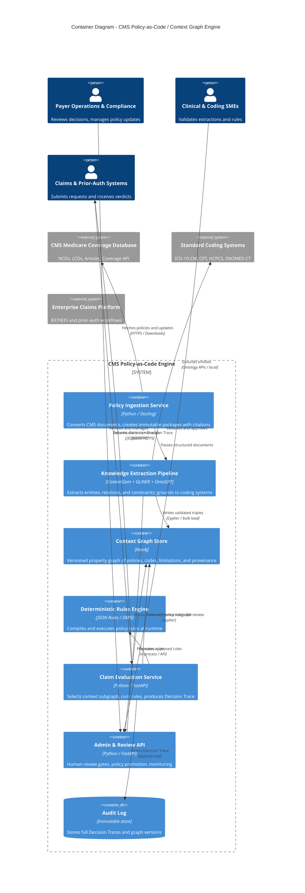

# C4 Container Diagram

```mermaid
C4Container
  title Container Diagram - CMS Policy-as-Code / Context Graph Engine

  Person(payerOps, "Payer Operations & Compliance", "Reviews decisions, manages policy updates")
  Person(clinicalSME, "Clinical & Coding SMEs", "Validates extractions and rules")
  Person(claimsSystem, "Claims & Prior-Auth Systems", "Submits requests and receives verdicts")

  System_Boundary(policyEngine, "CMS Policy-as-Code Engine") {
    Container(ingestion, "Policy Ingestion Service", "Python / Docling", "Converts CMS documents, creates immutable packages with citations")
    Container(extraction, "Knowledge Extraction Pipeline", "ContextGem + GLiNER + OntoGPT", "Extracts entities, relations, and constraints; grounds to coding systems")
    Container(graphStore, "Context Graph Store", "Neo4j", "Versioned property graph of policies, codes, limitations, and provenance")
    Container(rulesEngine, "Deterministic Rules Engine", "JSON Rules / DMN", "Compiles and executes policy rules at runtime")
    Container(evalService, "Claim Evaluation Service", "Python / FastAPI", "Selects context subgraph, runs rules, produces Decision Trace")
    Container(adminApi, "Admin & Review API", "Python / FastAPI", "Human review gates, policy promotion, monitoring")
    ContainerDb(auditLog, "Audit Log", "Immutable store", "Stores full Decision Traces and graph versions")
  }

  System_Ext(cms, "CMS Medicare Coverage Database", "NCDs, LCDs, Articles, Coverage API")
  System_Ext(codingSystems, "Standard Coding Systems", "ICD-10-CM, CPT, HCPCS, SNOMED CT")
  System_Ext(claimsPlatform, "Enterprise Claims Platform", "837/835 and prior-auth workflows")

  Rel(claimsSystem, evalService, "Submits claim / prior-auth", "JSON/HTTPS")
  Rel(evalService, claimsSystem, "Returns decision + Decision Trace", "JSON/HTTPS")
  Rel(evalService, graphStore, "Retrieves policy subgraph", "Cypher")
  Rel(evalService, rulesEngine, "Executes rules", "In-process / API")
  Rel(evalService, auditLog, "Writes Decision Trace", "Append-only")

  Rel(ingestion, cms, "Fetches policies and updates", "HTTPS / Downloads")
  Rel(ingestion, extraction, "Passes structured documents")
  Rel(extraction, codingSystems, "Grounds entities", "Ontology APIs / local")
  Rel(extraction, graphStore, "Writes validated triples", "Cypher / bulk load")
  Rel(extraction, adminApi, "Routes low-confidence items for review")

  Rel(payerOps, adminApi, "Reviews and manages")
  Rel(clinicalSME, adminApi, "Validates and approves")
  Rel(adminApi, graphStore, "Promotes approved rules")
```
