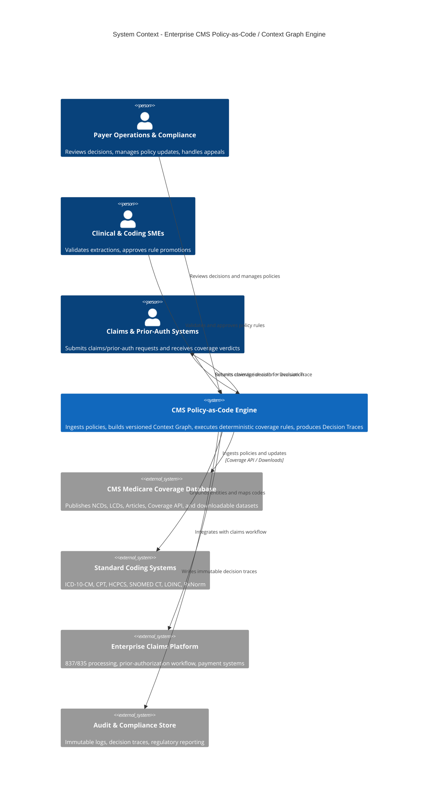

# C4 System Context Diagram

```mermaid
C4Context
  title System Context - Enterprise CMS Policy-as-Code / Context Graph Engine

  Person(payerOps, "Payer Operations & Compliance", "Reviews decisions, manages policy updates, handles appeals")
  Person(clinicalSME, "Clinical & Coding SMEs", "Validates extractions, approves rule promotions")
  Person(claimsSystem, "Claims & Prior-Auth Systems", "Submits claims/prior-auth requests and receives coverage verdicts")

  System(policyEngine, "CMS Policy-as-Code Engine", "Ingests policies, builds versioned Context Graph, executes deterministic coverage rules, produces Decision Traces")

  System_Ext(cms, "CMS Medicare Coverage Database", "Publishes NCDs, LCDs, Articles, Coverage API, and downloadable datasets")
  System_Ext(codingSystems, "Standard Coding Systems", "ICD-10-CM, CPT, HCPCS, SNOMED CT, LOINC, RxNorm")
  System_Ext(claimsPlatform, "Enterprise Claims Platform", "837/835 processing, prior-authorization workflow, payment systems")
  System_Ext(auditStore, "Audit & Compliance Store", "Immutable logs, decision traces, regulatory reporting")

  Rel(payerOps, policyEngine, "Reviews decisions and manages policies")
  Rel(clinicalSME, policyEngine, "Validates and approves policy rules")
  Rel(claimsSystem, policyEngine, "Submits claim/prior-auth for evaluation")
  Rel(policyEngine, claimsSystem, "Returns coverage decision + Decision Trace")

  Rel(policyEngine, cms, "Ingests policies and updates", "Coverage API / Downloads")
  Rel(policyEngine, codingSystems, "Grounds entities and maps codes")
  Rel(policyEngine, claimsPlatform, "Integrates with claims workflow")
  Rel(policyEngine, auditStore, "Writes immutable decision traces")
```
